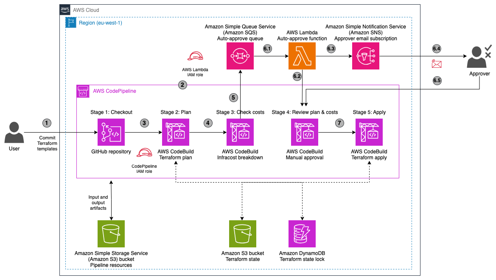

# Terraform pipeline with AWS CodePipelines and costs estimation with Infracost

Terraform is an infrastructure-as-code (IaC) tool that helps you create, update, and version your infrastructure in a secure and repeatable manner.

The scope of this solution is to provide an example terraform configurations to set up pipeline with costs validation based on AWS CodePipeline, AWS CodeBuild, Terraform and Infracost.

The created pipeline uses the common practices for infrastructure lifecycle and has the below stages

- **plan** - This stage creates an execution plan, which lets you preview the changes that Terraform plans to make to your infrastructure.
- **check costs** - This stage prepares the costs report that can help to estimate the changes in monthly costs for the infrastructure managed by current Terraform project
- **review plan** - This stage represents a manual approval step needed to decide if the given plan
- **apply** - This stage uses the plan created above to provision the infrastructure in the test account.

## Overview

The repository contains a [CloudFormation template](pipeline/CodePipeline-Terraform-CF.yaml) that after deploying will result in the following setup:


The whole logic of the solution works as follows:
1. Developer commits changes to a Terraform template in the GitHub repository (1)
2. CodePipeline is triggered via CodeStar connection (2)
3. The source code is checked out (3)
4. [CodeBuild step](pipeline/buildspec-tf-plan.yaml) executes ```terraform plan``` and outputs the TF plan as artifact (4)
5. [CodeBuild step](pipeline/buildspec-check-costs.yaml) uses ```infracost breakdown``` to generate costs diff according to changes in TF plan, and sends a trigger for the auto-approve Lambda funtion (5)
6. The pipeline stops at a Manual approval step and the approval process starts:
   1. Auto-approve functions is triggered by SQS queue with configurable delay (6.1)
   2. If the approval thresholds are not breached, the function confirms the changes (6.2)
   3. Alternatively, if the difference in infrastructure costs is larger than the defined absolute or percentage threshold, the function sends a message to the SNS topic (6.3)
   4. The Approver is notified (6.4), checks the TF plan and the associated costs, and approves or rejects the changes manually (6.5)
7. If the changes were approved, the last [CodeBuild step](pipeline/buildspec-tf-apply.yaml) runs ```terraform apply```

The costs estimate is done with the [**Infracost**](https://github.com/infracost/infracost) utility. Is a tool to show cloud cost estimates
for Terraform. Infracost supports over **1,000** Terraform resources across [AWS](https://www.infracost.io/docs/supported_resources/aws), [Azure](https://www.infracost.io/docs/supported_resources/azure) and [Google](https://www.infracost.io/docs/supported_resources/google).
We will be using it to create a costs breakdown in our sample Terraform project.

For the usage-based resources (S3 storage, data transfer, autoscaling groups of EC2 instances) Infracost cannot precisely
forecast the costs. To provide a baseline prediction of the used resources during costs breakdown, we manually specify them
in the config file [infracost-usage.yml](infracost-usage.yml). It contains sample entries for the S3 usage and EKS node
groups defined in the TF project. Read more in the Infracosts's documentation
on [Usage-based resources](https://www.infracost.io/docs/features/usage_based_resources/)

## Directory structure
```
├── infracost-usage.yml
├── LICENSE
├── README.md
├── assets
│   ├── pipeline.bgwhite.png
│   └── pipeline.drawio
├── lambda
│   └── index.py
├── infracost-usage.yml
├── pipeline
│   ├── CodePipeline-Terraform-CF.yaml
│   ├── buildspec-check-costs.yaml
│   ├── buildspec-tf-apply.yaml
│   └── buildspec-tf-plan.yaml
│   └── costs.json
└── tf
    ├── backend.tf
    ├── eks.tf
    ├── main.tf
    └── variables.tf
```

## Deployment
To deploy the project, please apply the CLoudFormation template [CodePipeline-Terraform-CF.yaml](pipeline/CodePipeline-Terraform-CF.yaml).
Upon deployment, please provide the values for template parameters. The description and default values for them are [below](#cloudformation-template-variables).
Please make sure to provide an approver's email as a parameter to the template' _InitialSubscriberEmail_ parameter,
or subscribe to the SNS topic "_**<StackName>-PipelineNotificationTopic-**_" later, to receive the approval emails.

When the deployment is finished, please open your AWS console, open AWS Lambda service and find the newly created function - it
should have the name ending with "_**-autoapprove-function**_". Please open the Lambda code editor and replace the sample source code
with the content of [index.py](lambda/index.py) file.

The deployment will also deploy Terraform scripts defined within [tf](tf) folder. To allow successful keeping of the
Terraform state between pipeline runs, please make sure to define the Terraform backend. Create or select an S3 bucket
for the TF state and a DynamoDB table for the TF state lock. Modify the [backend.tf](tf/backend.tf) with the references
to the bucket and table accordingly

## CloudFormation template variables
These variables will be required during deployment of the project's [CloudFormation template](pipeline/CodePipeline-Terraform-CF.yaml):

| **Name** | **Description** | **Default value** |
|---|---|---|
| AutoApproveDelaySeconds | Delay to trigger the auto-approve logic (in seconds) | 30 |
| AutoApproveDiffAbsoluteThreshold | Delay to trigger the auto-approve logic (in seconds) | 100 |
| AutoApproveDiffPercentThreshold | Delay to trigger the auto-approve logic (in seconds) | 10 |
| BuildImageName | Build container for the pipeline step | aws/codebuild/amazonlinux2-x86_64-standard:3.0 |
| CodeStarConnectionArn | ARN of the CodeStar - GitHub connection -Infracost [see below](#codestar-connection) | |
| Environment | Environment name | dev |
| GitHubBranch | Branch that will be monitored | main |
| GitHubRepo | GitHub repository to monitor, as <Organization name>/<repository> | |
| InfracostApiKey | API key for Infracost utility - [see below](#infracost-api-key) | |
| InitialSubscriberEmail | Initial email address that will receive manual approval requests | NONE |
| PipelineBucket | S3 bucket to use with CodePipelines and store pipeline artifacts |  |

### CodeStar connection
AWS CodeStar Connections is a feature that allows services like AWS CodePipeline to access third-party code source provider.
For our example, you can now seamlessly connect your GitHub source repository to AWS CodePipeline.
This allows you to automate  the build, test, and deploy phases of your release process each time a code change occurs.
When a push is made to a monitored GitHub repo, the CodePipeline will trigger.

Please use the [instructions in the AWS blog post](https://aws.amazon.com/blogs/devops/using-aws-codepipeline-and-aws-codestar-connections-to-deploy-from-bitbucket/) to set up a Connection for GitHub. When done, provide the AN of the connection into **CodeStarConnectionArn** param.

### Infracost API Key

To use the open source Infracost utility, please create a free account at (infracost.io) - you can sign up
with your GitHub account. Then [get an API key](https://www.infracost.io/docs/#2-get-api-key) and provide it into the **InfracostApiKey** param


